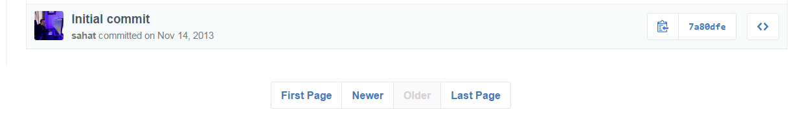

# github-first-commit

Inspired by: <a href='http://first-commit.com/'>http://first-commit.com/</a>, <a href='https://news.ycombinator.com/item?id=10610065'>https://news.ycombinator.com/item?id=10610065</a>

See also: <a href='https://github.com/FarhadG/init'>https://github.com/FarhadG/init</a>

## Installation

[how-to-install-a-chrome-extension-without-using-the-chrome-web-store](https://blog.hunter.io/how-to-install-a-chrome-extension-without-using-the-chrome-web-store-31902c780034)
